# PathFinder Learning Recommender 📚🧠

PathFinder Learning Recommender is a personalized platform that suggests books and videos based on user interests, learning goals, or specific skills. Using intelligent filtering and vector search (via Pinecone), the system provides meaningful, tailored learning content for each user.

Whether you're upskilling in AI, exploring Python, or diving into web development, PathFinder helps you find the best resources and fast.

## 🧰 Tech Stack

- **Backend:** Django
- **Database:** PostgreSQL
- **Frontend:** HTML, CSS (custom)
- **APIs Used:**
  - [Open Library API](https://openlibrary.org/developers/api) – for book data
  - [YouTube Data API v3](https://developers.google.com/youtube/v3) – for video recommendations
  - [Pinecone](https://www.pinecone.io/) – for vector-based content matching
- **Hosting:** Render
- **Version Control:** Git + GitHub

## ✨ Features

- Personalized book and video recommendations
- Supports both content-based (TF-IDF + cosine similarity) and vector-based (Pinecone) search
- Responsive layout for mobile and desktop
- User authentication (Login/Register/Profile)
- Seamless integration of external APIs
- Intuitive interface with clean layout
- Real-time query analysis

## 📸 Screenshots

### Home Page
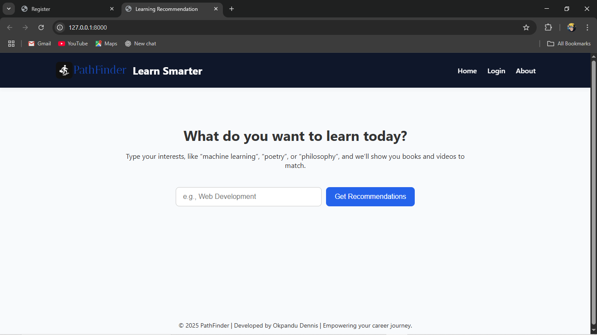

### Recommendations Page(books)
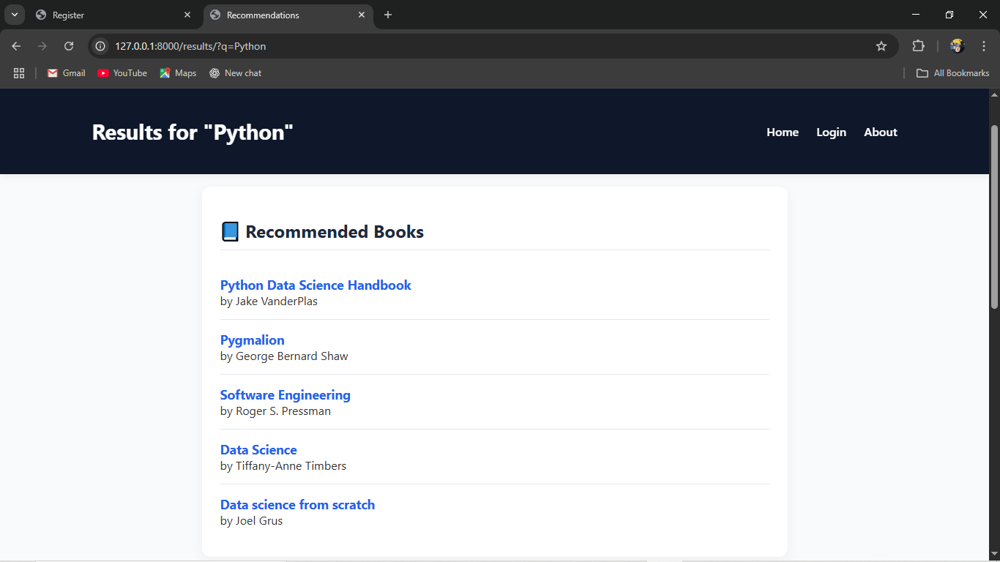

### Recommendations Page(videos)
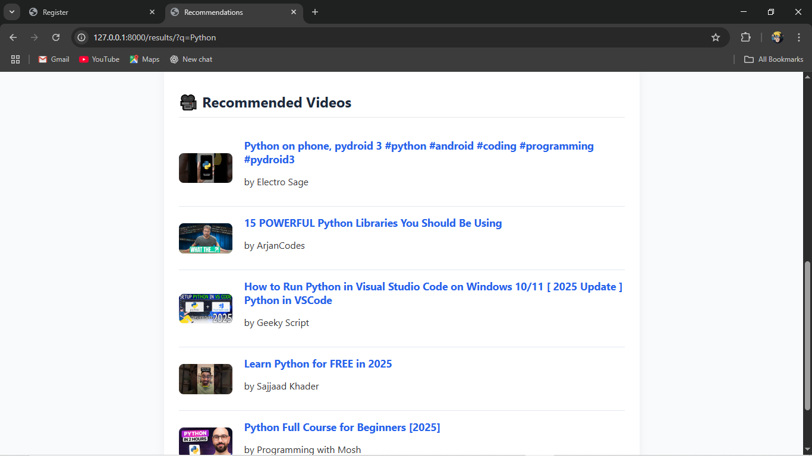

### About Page
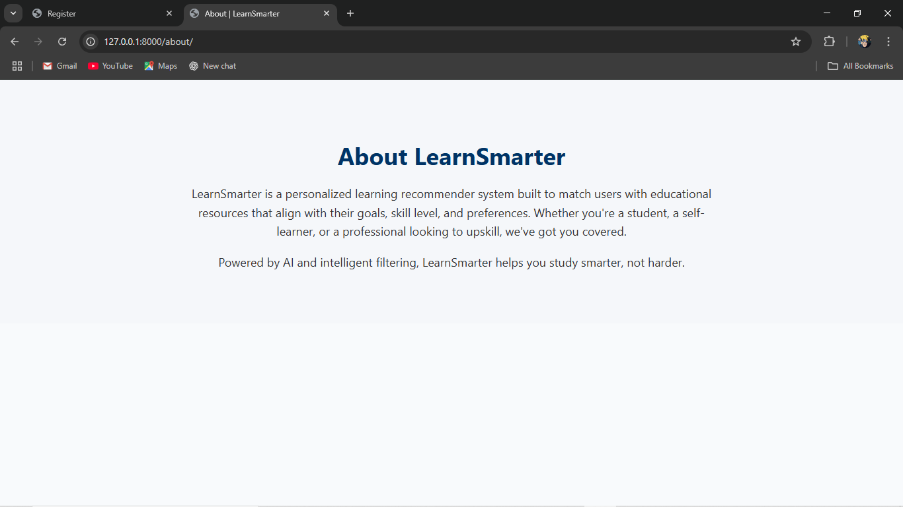

### Login Page
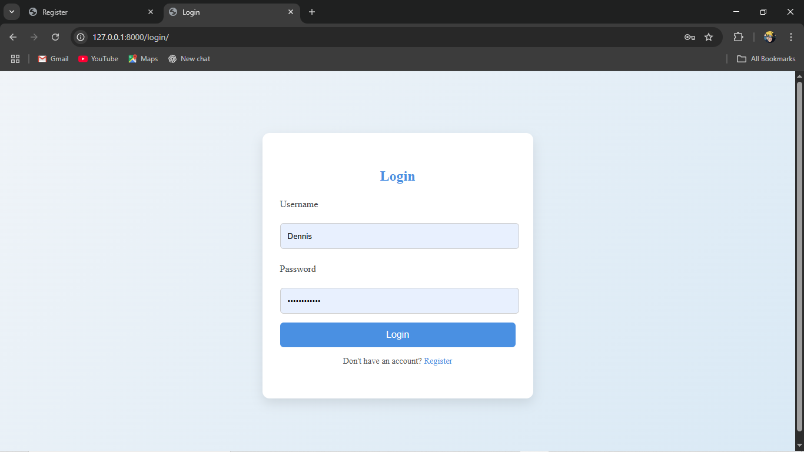

### Register Page
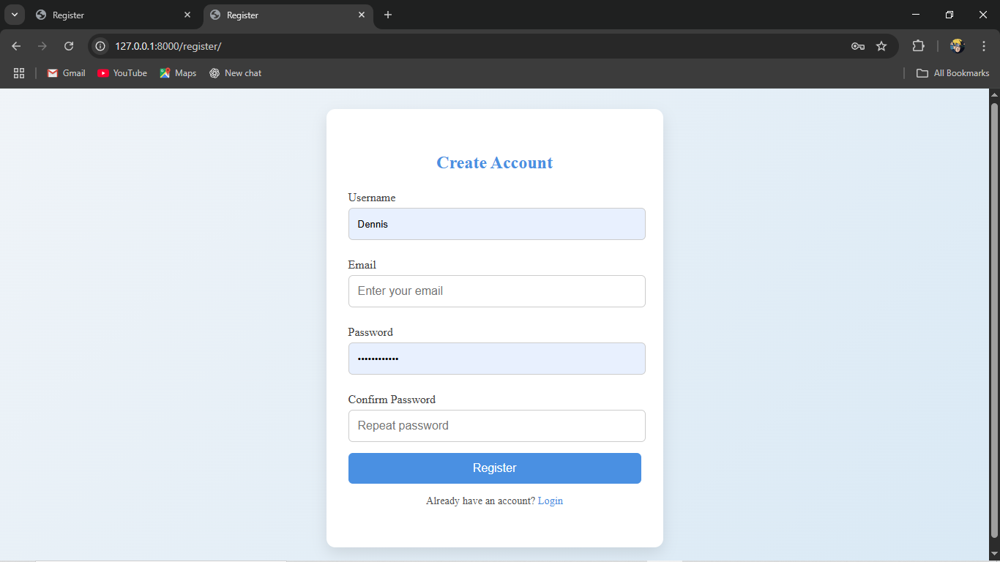

### Mobile Home Page (Using Browser Inspect)
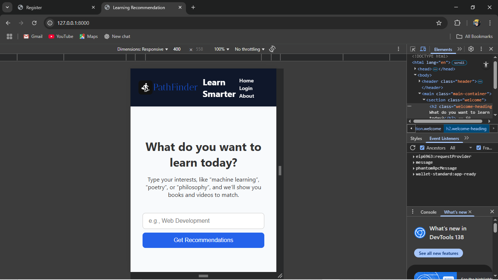

### Mobile Login Page (Using Browser Inspect)
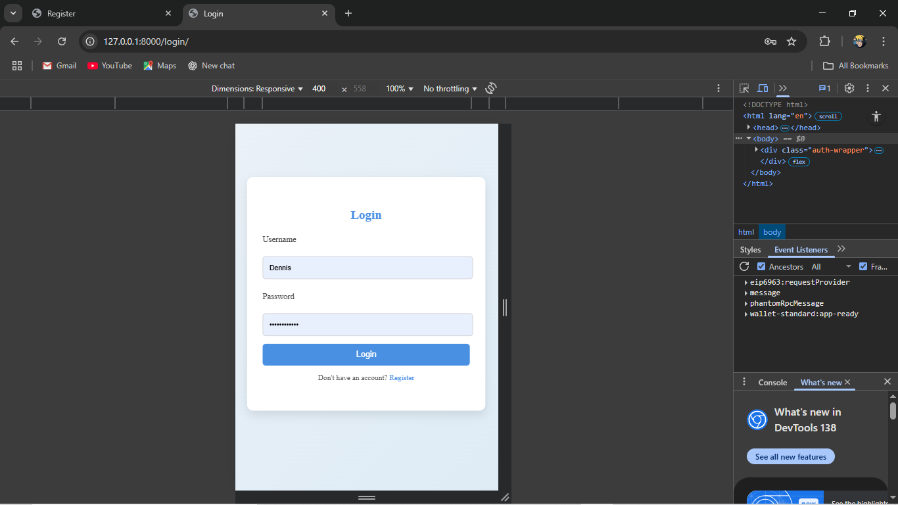

### Mobile Register Page (Using Browser Inspect)
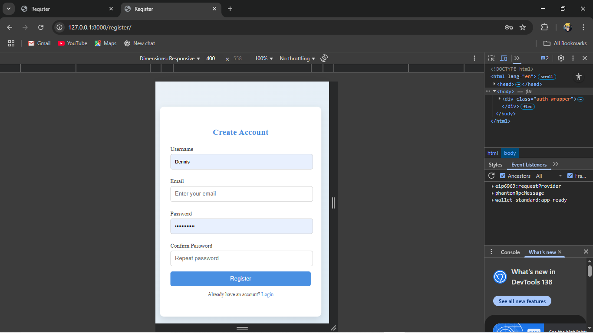

### Mobile About Page (Using Browser Inspect)
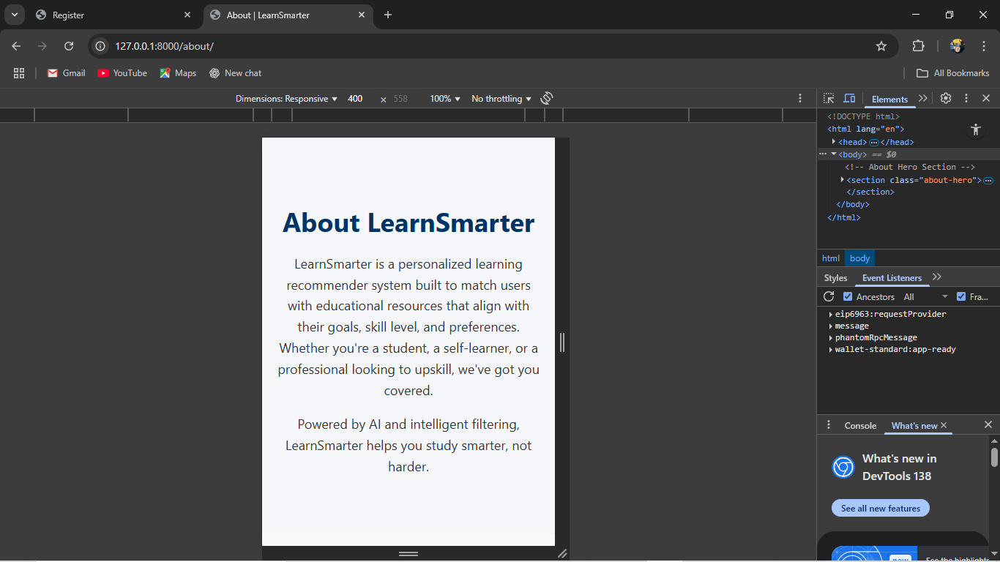

### Mobile Recommendation Page for books (Using Browser Inspect)
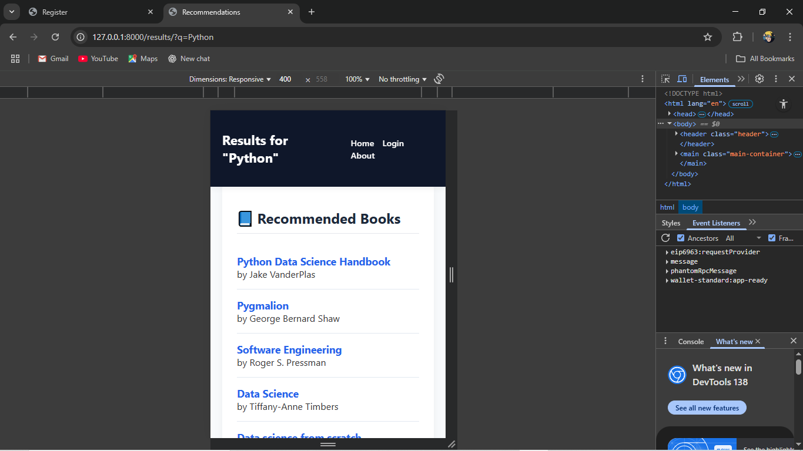

### Mobile Recommendation Page for videos (Using Browser Inspect)
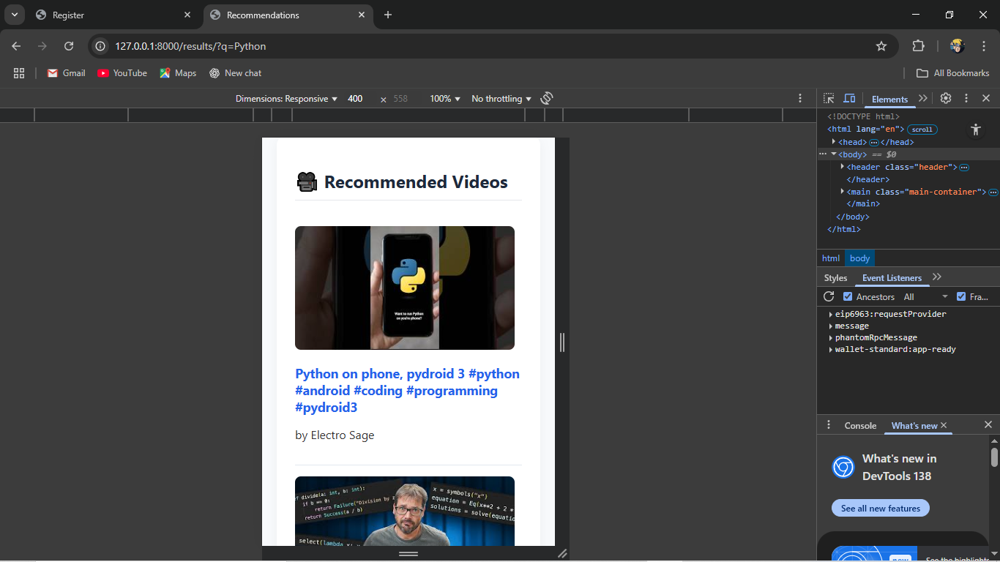

### Mobile Recommendation Page for videos (Using Browser Inspect)
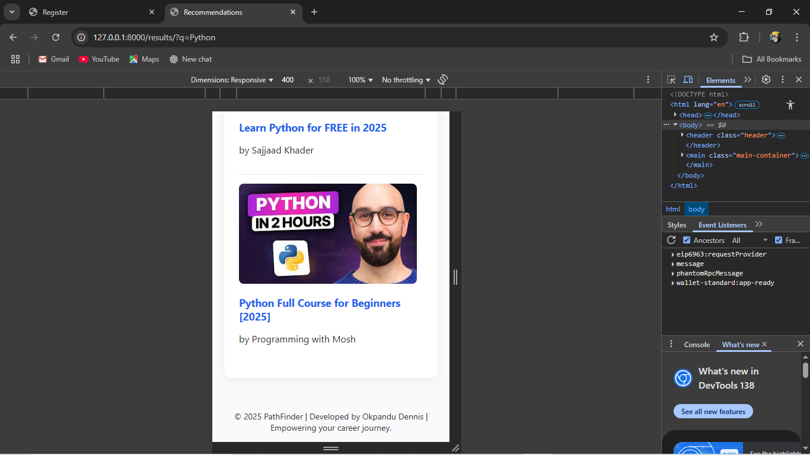

